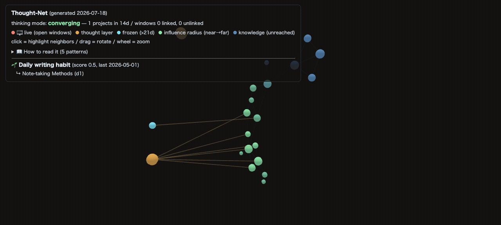

# Thought-Net

**A three-layer force graph of your knowledge, your active projects, and the terminal windows you have open right now.**

Most knowledge-graph tools draw one layer: your notes and the links between them. Thought-Net stacks three layers on the Z axis and connects them:

- **Knowledge layer** — your Markdown vault (notes + `[[wikilinks]]` + path references)
- **Thought layer** — your active project ledgers and past work contexts
- **Live layer** — the projects your currently-open editor/terminal sessions are working on

On top of the structure it computes two things a plain graph can't:

- **Influence radius** — starting from the notes you touched in the last *N* days, it does a graph BFS and colors every node by how far your recent work reaches. You see, at a glance, which 60% of your knowledge your current thinking touches — and the dark continent it doesn't.
- **Thaw candidates** — for each dormant project, it measures graph proximity to your recent work and surfaces "reopening this might connect" — serendipity, computed instead of waited for.

It's a single self-contained HTML file. Regenerate with one command. Read-only against your vault. No LLM, no cloud, no telemetry — pure Python stdlib.



*(Running on the bundled synthetic vault via `python3 build.py --demo`.)*

## Why it's different

A quick survey of the field (Obsidian graph plugins, Logseq, Smart Connections, InfraNodus, TheBrain, ActivityWatch, and academic semantic-desktop work) turned up parts of this idea but not the combination:

| Capability | Closest prior art | Gap Thought-Net fills |
|---|---|---|
| Z-axis semantic layers | — (3D graph plugins use Z for physics only) | Knowledge / thought / live as *meaningful* stacked planes |
| Influence radius (recency × graph distance) | Eclipse Mylyn degree-of-interest (IDE trees, not graphs) | BFS-distance coloring over a knowledge graph |
| Thaw / serendipity | Smart Connections (embedding similarity), InfraNodus structural gaps | dormancy × recent-work proximity, time-aware |
| Live process layer | ActivityWatch (timeline, not graph) | running sessions pinned onto the knowledge graph |

## Quickstart

```bash
git clone https://github.com/adpt-myzk/thought-net
cd thought-net

# See it work on the bundled synthetic vault — no setup, no real data
python3 build.py --demo
open out/thought-net.html      # macOS; use xdg-open on Linux
```

Then point it at your own vault:

```bash
export THOUGHTNET_VAULTS="notes=$HOME/my-vault"
export THOUGHTNET_PROJECTS_DIR="$HOME/my-vault/projects"
python3 build.py
open out/thought-net.html
```

Requirements: Python 3.9+ and nothing else. The 3D renderer ([3d-force-graph](https://github.com/vasturiano/3d-force-graph), MIT) is vendored and inlined — the output HTML has zero external requests.

## Configuration

All paths are environment variables; defaults match the author's layout but nothing is hardcoded to a person.

| Variable | Meaning | Default |
|---|---|---|
| `THOUGHTNET_VAULTS` | `name=path` pairs, colon-separated | `logbook=~/logbook:karpathy-wiki=~/karpathy-wiki` |
| `THOUGHTNET_PROJECTS_DIR` | project ledgers (notes with `status:` frontmatter) | `<first vault>/projects` |
| `THOUGHTNET_ECC_DIR` | session records for the influence radius (optional) | `~/.claude/session-data` |
| `THOUGHTNET_PHI_BLOCK` | comma-separated path substrings to exclude entirely | `取引記録` |
| `THOUGHTNET_OUT` | output directory | `./out` |
| `THOUGHTNET_FROZEN_DAYS` / `THOUGHTNET_RECENT_DAYS` | dormancy / recency windows | `21` / `14` |

A "project ledger" is any note under the projects dir with a `status:` frontmatter field. `last_touch:` (ISO date) drives dormancy; body links (`[[wikilink]]`, `path/to/note.md`, or `[text](path)`) become edges.

## Privacy model

This tool reads a personal knowledge base and your running processes, so it is built to leak nothing:

- **Labels only** — node labels come from filenames / frontmatter titles. Note *bodies* and conversation logs are never rendered.
- **Redaction pass** — every label is scrubbed for phone numbers, national-ID numbers, API-key patterns, emails, and long hex tokens before output.
- **Path blocklist** — any path containing a `THOUGHTNET_PHI_BLOCK` substring is dropped node-and-edge.
- **Live layer reads metadata, never content** — process detection uses only tty, elapsed time, cwd, and `--add-dir` paths. Command arguments, environment variables, and session transcripts are never read. A window's project is revealed only when its working directory matches a *known* project — unknown/secret-named directories show as `ttyNNN (age)` with no path.
- **HTML is XSS-safe** — vault-derived strings are treated as untrusted input (escaped / `textContent` only), and the embedded JSON is escaped against `</script>` breakout.
- **`.gitignore` keeps data out of git** — `out/` (the rendered graph of your actual notes) is never committed. The code is public; your graph is yours.

## Optional: connect live terminal windows

Thought-Net can pin the projects your open sessions are working on onto the graph. Add a launch wrapper that records `tty → working directory` on start (interactive sessions only):

```sh
# in ~/.zshrc — records only the launch directory, never command content
myeditor() {
  if [[ -t 0 && -t 1 ]]; then
    local t="${$(tty)##*/}"
    mkdir -p ~/.thought-net/live-map
    print -r -- "$PWD" > ~/.thought-net/live-map/$t
  fi
  command myeditor "$@"
}
```

(The reference implementation wraps the Claude Code CLI; adapt the command to your tool. Windows launched inside a known project connect automatically.)

## Status

Working, single-author tool made public in the hope it's useful. The defaults assume an Obsidian-style vault with a `projects/` folder of status-tagged ledgers; generalizing to arbitrary vault structures is tracked in Issues. Contributions welcome.

## License

MIT — see [LICENSE](LICENSE). Bundled third-party components are listed in
[THIRD-PARTY-NOTICES.md](THIRD-PARTY-NOTICES.md).
